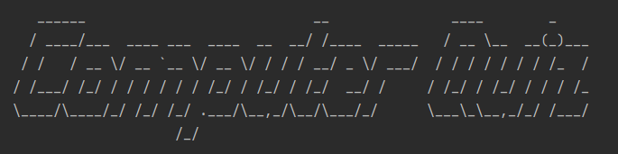

# quiz-app
A python quiz app that fetch random 10 computer questions from Open Trivia Database API  
The app is modular at its best with the use of object-oriented programming.
The data could be changed over without affecting the functionality of the app.

