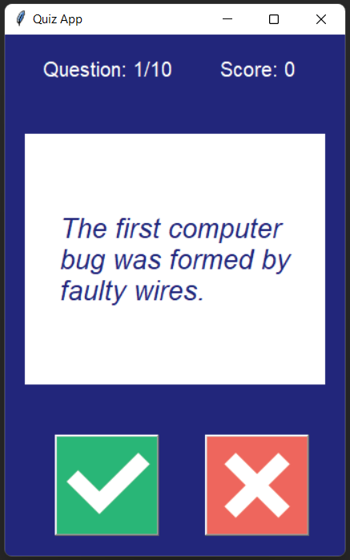

# quiz-app

- A python quiz app that fetch random 10 computer questions from Open Trivia Database API.   
- The app was built with object-oriented programming best practices.
- Graphic User Interface was integrated with Tkinter, Canvas, and PhotoImage.

